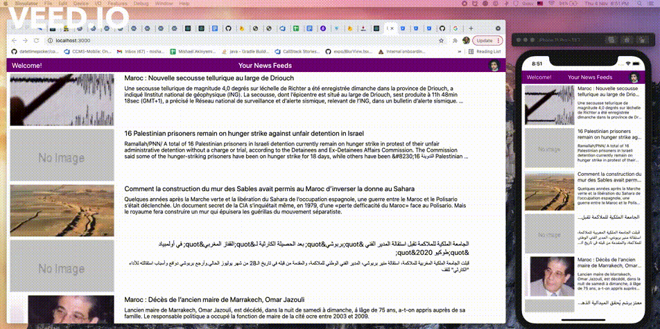

# react-cross-platform-project

This is a simple cross platform app (web, Android and iOS) from a single code base.
It uses [Suspense](https://reactjs.org/docs/concurrent-mode-suspense.html) to handle rendering during API calls to a free news API.
Several components are shared accross the web and mobile app.

## Demo

## To run web-app

`yarn web`

## to run ios app:

`yarn ios`

## to run android app:

`yarn android`
